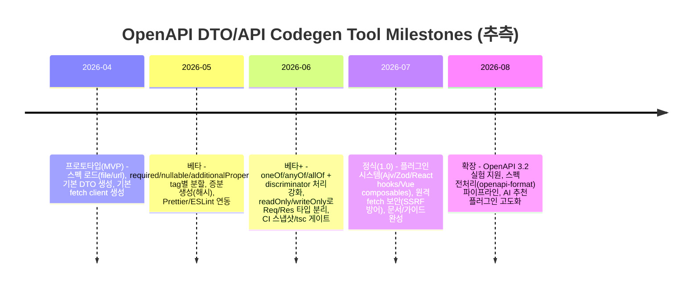

# 스웨거/OpenAPI 기반 프론트엔드 DTO·API 파일 자동 생성 툴 설계·구현 분석 보고서

이 문서는 대화 중 제공된 외부 설계 보고서 원문 보관본입니다.

- 목적:
  - 설계 근거 원문을 보존
  - 내부 결정 문서와 분리
- 관련 문서:
  - 검토/채택 문서: [08-external-report-review.md](08-external-report-review.md)

---

## Executive Summary

이 보고서는 **OpenAPI(또는 Swagger) 명세(로컬 파일/원격 URL)**를 입력으로 받아, **Next.js/React(TypeScript) 및 Vue3(TypeScript)** 프론트엔드 프로젝트에서 바로 사용할 수 있는 **DTO(TypeScript 타입/인터페이스) + API 호출 레이어(함수/클라이언트)**를 자동 생성하는 **코드젠(codegen) 툴**을 설계·구현하는 방법을 다룹니다. 핵심 난점은 “스펙 → 타입 생성” 자체보다, **프로젝트마다 다른 네이밍 컨벤션/폴더 구조/API 사용 방식(fetch/axios/React Query 등)을 어떻게 흡수해 ‘팀 표준’에 맞는 결과물을 일관되게 내보낼 것인가**입니다.

요청 내용을 바탕으로 질문을 더 정확히 정제하면 아래와 같습니다.

> 정제한 질문: “OpenAPI 2.0/3.x 명세를 입력 받아, Next.js/React·Vue3(TypeScript) 프로젝트별 컨벤션(네이밍·파일 분할·API 호출 패턴·에러 처리·인증)과 선택적 런타임 검증(Ajv/Zod 등)을 반영하여 DTO와 API 모듈을 **결정론적으로** 생성하는 CLI/라이브러리를 어떻게 설계·구현할 것인가?”

권장 아키텍처는 **파이프라인 기반(전처리→파싱/해결→정규화(IR)→생성→검증/포맷팅)**이며, 특히 **OpenAPI 3.1의 JSON Schema 2020-12 기반 스키마**와 **OpenAPI 2.0(구 Swagger 2.0)**의 구조 차이를 흡수하기 위한 “정규화 층”이 필수입니다. OpenAPI 3.0은 Schema Object가 **JSON Schema Wright Draft 00(드래프트5 계열)**의 확장/부분집합이고 `null` 타입을 직접 지원하지 않아 `nullable`로 우회하는데 비해, OpenAPI 3.1은 Schema Object가 **JSON Schema Draft 2020-12의 상위 집합**이며 `jsonSchemaDialect`/`$schema`로 방언(dialect)까지 지정 가능합니다. citeturn4view1turn5view2turn5view1

현실적으로는 (1) **기존 엔진(예: OpenAPI Generator)**을 템플릿/옵션으로 감싸는 “래퍼형”으로 빠르게 MVP를 만든 뒤, (2) 컨벤션 적응·증분 생성·플러그인·AI 보조까지 포함한 “자체 코드젠 코어”로 확장하는 2단계 접근이 비용 대비 안정적입니다. OpenAPI Generator는 명세 기반으로 클라이언트 SDK/문서/서버 스텁 등을 생성하는 범용 도구이며(명세 2.0/3.0 지원 명시), TypeScript Fetch 생성기 역시 기본 템플릿 엔진이 Mustache인 등 템플릿 기반 커스터마이징이 구조적으로 가능합니다. citeturn1search1turn1search8turn1search27

---

## 목표 및 사용 사례

대상 우선순위는 **React+TypeScript(Next.js 포함)**와 **Vue3+TypeScript**이며, 그 외 프레임워크는 “제약 없음(unspecified)”으로 둡니다. 생성 결과물은 최소한 아래 두 범주를 포함해야 합니다.

- **DTO 레이어**: `components/schemas`(OAS3) 또는 `definitions`(OAS2) 및 operation의 request/response schema로부터 **TypeScript 타입(interfaces/type alias)** 생성
- **API 레이어**: 각 operation을 **타입 안정적 함수**로 생성(예: `getUser(params): Promise<UserResponse>`), 공통 클라이언트(`fetch` wrapping, baseURL, auth header, error mapping) 포함

OpenAPI 3.0의 `requestBody`는 media type별 `content`와 schema를 가지며, `required` 플래그가 기본적으로 `false`(즉 요청 바디는 기본 optional)입니다. citeturn9search0 OpenAPI 2.0에서는 request body가 “body parameter”로 표현되며, payload는 하나뿐이므로 body parameter도 하나만 허용됩니다. citeturn9search1turn9search9

프로젝트별로 달라지는 변수를 “툴 설계 관점에서” 분해하면 다음 4개 축이 가장 큽니다.

- **네이밍 컨벤션**: `operationId` 기반/경로 기반 함수명, 타입명 접두·접미사(`Dto`, `Response`, `Req`), enum 케이스 변환, `snake_case`→`camelCase` 매핑 등
- **파일 분할 전략**: tag별 모듈화, 도메인(경로 prefix)별, “한 파일에 types만” vs “types+api 같이” 등
- **HTTP 계층 표준**: `fetch`/`axios`, 공통 헤더·인증(예: Bearer 토큰), 오류 표준화(에러 바디 스키마)
- **에코시스템 연동**: React Query/SWR hooks, Vue composable, 런타임 검증(Ajv/Zod) 옵션

여기서 “AI를 중간에 사용”하려면, 코드젠의 결정론을 깨지 않게 설계해야 합니다. 권장 방식은 **AI가 “추천안(설정/매핑 규칙)”만 만들고, 최종 생성은 config+템플릿으로 결정론적으로 수행**하는 구조입니다. 예를 들어:
- 레포를 스캔해 “기존 API 함수 네이밍 패턴”을 추출 → AI가 `operationId`가 없는 스펙에 대한 함수명 생성 규칙을 제안
- 스키마/필드명의 의미를 해석해 “DTO suffix 규칙” 추천
단, 이 단계는 **옵션 플러그인**으로 분리하고, CI에서는 “AI 비활성 + 고정 config”로 재현 가능하도록 두는 것이 안전합니다(추측입니다).

---

## 스펙 지원 범위와 필드 처리 규칙

### 지원할 스펙 버전 범위

- **OpenAPI 2.0(= Swagger 2.0)**: 스펙 상 데이터 타입은 JSON Schema Draft 4 기반이며, 파일은 `swagger.json` 관례를 언급합니다. citeturn3view2
- **OpenAPI 3.0.x**: `openapi` 필드로 버전을 선언하며 Schema Object는 JSON Schema Wright Draft 00의 확장/부분집합입니다. 특히 `null` 타입을 직접 지원하지 않아 `nullable`로 대체합니다. citeturn4view1turn4view2
- **OpenAPI 3.1.x**: 데이터 타입은 JSON Schema Draft 2020-12 기반이며 Schema Object는 해당 드래프트의 “상위 집합(superset)”입니다. `jsonSchemaDialect` 및 `$schema`로 방언 지정이 가능하므로 런타임 검증 생성 시 매우 중요합니다. citeturn5view2turn5view1
- (선택) **OpenAPI 3.2**: 이미 공식 스펙 문서가 존재하며, 일부 도구 생태계는 3.2 지원을 발표했습니다. 다만 본 보고서의 필수 목표는 2.0 및 3.x이므로 3.2는 “확장 목표”로 두는 편이 현실적입니다. citeturn0search9turn2search24

### 필수/선택 필드 처리 규칙(핵심)

TypeScript DTO 생성에서 가장 중요한 것은 `required`, `nullable`, `readOnly/writeOnly`, `additionalProperties`, 합성 스키마(oneOf/anyOf/allOf)의 해석입니다.

#### required → optional 처리

OpenAPI 3.0 Schema Object는 JSON Schema의 `required`를 포함합니다. citeturn8view0
OpenAPI 2.0에서도 모델 예시에서 `required: [ ... ]`가 schema 레벨에 존재합니다. citeturn4view3

권장 규칙:
- `properties`에 있는 필드 중 `required` 배열에 포함 → `prop: T` (non-optional)
- 미포함 → `prop?: T` (optional)
- 단, **request/response 분리 타입**을 만들면 `readOnly/writeOnly`에 따라 required 적용 범위가 달라집니다(아래).

#### nullable 처리(3.0 vs 3.1)

OpenAPI 3.0에서는 `null`이 타입으로 지원되지 않으며 `nullable: true`로 null 허용을 표현합니다. citeturn4view1turn4view2
OpenAPI 3.1은 JSON Schema 2020-12 기반이므로 `type: ["string","null"]` 같은 표현이 가능하나, 현장에서는 3.0의 `nullable` 관행이 남아 혼란이 보고됩니다. citeturn5view2turn0search4

권장 규칙:
- 3.0: `nullable: true` → `T | null`
- 3.1: `type` 배열에 `null` 포함 → `T | null`
- 3.1에서 `nullable`이 온 경우: “비표준 키워드”로 보고 경고를 남기되, **호환성 모드**로 `T | null` 처리(실무 호환 목적, 추측입니다). 혼란 자체는 이슈로도 제기됩니다. citeturn0search4

또한 “optional + nullable”은 “값 존재”, “null”, “필드 누락”의 3상태를 만들므로 꼭 필요한 경우만 쓰라는 실무 가이드가 존재합니다. citeturn0search8 (이 문서는 공식 스펙이 아니라 실무 권고이므로, 툴 정책은 config로 두는 게 안전합니다.)

#### additionalProperties 처리

OpenAPI 3.0에서 `additionalProperties`는 boolean 또는 schema(object)일 수 있으며, schema일 경우 Schema Object여야 합니다. citeturn4view1turn8view0

권장 TS 매핑:
- `additionalProperties: true` (스키마 없음) → `Record<string, unknown>` 또는 config로 `any`
- `additionalProperties: { ...schema... }` → `Record<string, T>`
- `additionalProperties: false` → 인덱스 시그니처 없음(즉, 명시된 properties만)

#### readOnly/writeOnly + required의 방향성

OpenAPI 3.0은 `readOnly`/`writeOnly`의 의미와, 해당 필드가 `required`에 있을 때 **요청/응답 중 어디에 required가 적용되는지**를 명시합니다. citeturn8view1

권장 규칙(생성 타입을 최소 2개로 분리):
- `XResponse` 생성 시: `writeOnly: true` 속성 제거, `readOnly: true` 유지
- `XRequest` 생성 시: `readOnly: true` 속성 제거, `writeOnly: true` 유지
- `required`는 각각의 타입에서 위 규칙을 적용한 뒤 평가

이 분리 전략은 “프론트 DTO가 실제 API 계약을 더 정확히 반영”하게 해주며, 특히 보안/인증 필드(예: password)가 `writeOnly`인 경우 유용합니다. citeturn8view1

#### oneOf/anyOf/allOf 처리

OpenAPI 3.0은 `allOf`를 통한 모델 합성을 허용하며, 폴리모피즘을 위해 `discriminator`를 추가합니다. `discriminator`는 required여야 합니다. citeturn8view3
TypeScript에서 이를 표현하는 대표 전략은:
- `allOf` → intersection(`&`) 기반(단, 속성 충돌/옵셔널 합성 규칙 때문에 IR 수준에서 병합 로직이 필요할 수 있음)
- `oneOf`/`anyOf` → union(`|`) 기반
`oneOf`는 “정확히 하나만 만족”이라는 제약이 TypeScript 타입만으로는 완전 표현 불가하므로(추측입니다), 런타임 가드/검증(ajv/zod)을 옵션으로 제공하는 게 좋습니다. 실무적으로 oneOf/anyOf/allOf 사용상의 함정과 해결책을 다루는 자료도 존재합니다. citeturn0search33turn8view3

---

## 파서/코드젠 라이브러리 비교 및 선정 가이드

### 후보군 비교표

아래 표는 “스펙 파싱/검증/결합(bundling)/역참조(dereference)”와 “DTO/클라이언트 코드 생성” 관점에서 대표 후보를 비교한 것입니다(요청에 포함된 후보 우선, 필요시 추가 후보 포함).

| 후보 | 주 역할 | 지원 스펙(명시) | 강점 | 약점/주의 | 확장/커스터마이징 | 라이선스 |
| --- | --- | --- | --- | --- | --- | --- |
| `@apidevtools/swagger-parser` | 파싱/검증/역참조 | Swagger 2.0, OpenAPI 3.0(문서에 3.0 스키마 검증 명시) citeturn0search29 | Node/브라우저, 검증/역참조 제공 citeturn0search29 | OpenAPI 3.1은 명시적으로 다루지 않음(요구사항 충족에 공백) citeturn0search29 | 라이브러리 레벨 조합 용이 | MIT citeturn0search2 |
| `openapi-typescript` | DTO(TypeScript 타입) 생성 | OpenAPI 3.0 & 3.1 citeturn1search7turn1search11 | TS 타입 생성에 집중, 생태계(예: type-safe fetch) 언급 citeturn1search0 | OpenAPI 2.0은 범위 밖(사전 변환 필요) citeturn1search7 | 플러그인/후처리 조합 용이(자체 툴로 감싸기 적합) | MIT(공식 사이트에 명시) citeturn1search11 |
| `@openapitools/openapi-generator` | 범용 코드젠(클라/서버/문서) | OpenAPI 2.0 & 3.0 지원 명시 citeturn1search1 | 생성기 다수, TS Fetch 생성기 “STABLE” 및 Mustache 템플릿 기반 citeturn1search8turn1search27 | TS 생성기에서는 oneOf/anyOf 관련 이슈가 지속적으로 보고됨(템플릿/옵션 보완 필요) citeturn0search3turn0search37 | 템플릿 오버라이드(Mustache) 가능 citeturn1search8 | Apache-2.0 citeturn1search30 |
| `swagger-client`(repo: swagger-js) | 스펙 fetch/해결 + 클라이언트 상호작용 | Swagger 2.0 & OpenAPI 3 지원 명시 citeturn2search0turn2search20 | 스펙을 불러와 상호작용(해석/해결) 가능 citeturn2search0 | “코드 생성”보다는 “스펙 소비/호출”에 가까움 citeturn2search0 | 런타임 기반 툴과 조합 | Apache-2.0 citeturn2search0 |
| `openapi3-ts` | OpenAPI 문서 모델(타입) | OAS 3.0/3.1 분리 구현 명시 citeturn1search3turn1search21 | TypeScript로 스펙을 “다루기 위한 타입 모델” 제공 citeturn1search3 | 파싱/역참조/검증 도구라기보다 모델링 라이브러리 citeturn1search3 | IR 구현 시 타입 안정성 강화 | MIT citeturn1search3 |
| `swagger2openapi`(APIs-guru) | 2.0→3.0 변환/검증 | Swagger 2.0 → OpenAPI 3.0.x(“tracking v3.0.0” 명시) citeturn11view0 | 변환 옵션/검증/테스트 코퍼스 언급 citeturn11view0 | 3.1 목적이면 3.0으로의 변환 후 후속 처리 필요 citeturn11view0 | 변환 단계로 분리하기 좋음 | BSD-3-Clause(단, 일부 스키마는 Apache-2.0 조합) citeturn11view0 |
| `Mermade/oas-kit` | 변환/resolve/validate/lint 모노레포 | Swagger 2.0→OAS3.0, resolve/validate/lint citeturn11view1 | 변환+유틸 묶음 제공 citeturn11view1 | “Final planned release”가 오래 전으로 표시(유지보수 판단 필요) citeturn11view1 | 변환/린트 유틸 단계로 사용 가능 | BSD-3-Clause citeturn11view1 |
| `@readme/openapi-parser`(추가 후보) | 파싱/검증/역참조/번들 | Swagger 2.0, OAS 3.0, OAS 3.1 검증/역참조/번들 명시 citeturn12search3turn13search15 | “bundle/dereference” 지원 명시, Node>=18 엔진 명시 citeturn13search5 | GitHub repo는 “moved/archived” 표기(소스 위치 추적 필요) citeturn13search15 | 파서 코어로 채택하기 좋은 기능 범위 | MIT citeturn13search5turn13search0 |
| `@scalar/openapi-parser`(추가 후보) | TS 기반 파서/역참조/필터/업그레이드 | OAS3.1/3.0/Swagger2 지원 + 플러그인 기반 로딩 언급 citeturn13search9 | TS로 작성, URL/파일 로딩 플러그인, dereference/validate 제공 citeturn13search9 | 업그레이드 기능 문서에 “3.0→3.1만, Swagger2 업그레이드는 아직” 경고(기능 범위 명확화 필요) citeturn13search9 | “외부 참조 로딩”을 플러그인으로 교체 가능 citeturn13search9 | MIT citeturn13search9turn13search4 |

### 선정 가이드 및 권장 조합

요구사항(2.0 + 3.1까지)과 “프론트용 DTO+API 생성”을 동시에 만족하려면, 보통 다음 중 하나로 수렴합니다.

- **조합 A(래퍼형 MVP에 적합)**: `OpenAPI Generator` + 템플릿 오버라이드 + 후처리
  - 장점: 이미 “operation → client” 구조가 구현되어 있고, TypeScript Fetch 생성기 등 안정성 표기(STABLE) 및 템플릿 기반 확장이 명확합니다. citeturn1search8turn1search27
  - 단점: 프로젝트별 컨벤션을 “템플릿 커스터마이징”으로 해결해야 하며, anyOf/oneOf 등 스펙 구석에서 이슈가 발생할 수 있습니다(템플릿/옵션/후처리로 완화 필요). citeturn0search37turn0search3

- **조합 B(자체 코드젠 코어에 적합)**: “강력한 파서(@readme 또는 @scalar) + 자체 IR + 템플릿/AST 기반 출력”
  - 장점: 컨벤션 적응/증분 생성/플러그인/AI 추천을 구조화하기 좋고, DTO와 API 레이어를 프로젝트 표준에 맞춰 설계할 수 있습니다. 파서 레벨에서 bundle/deref/validate까지 제공하는 후보도 있습니다. citeturn12search4turn13search9
  - 단점: 합성 스키마·ref·미디어 타입·파라미터 직렬화 등 “스펙 디테일”을 IR로 다시 구현해야 하므로 개발량이 큽니다(추측입니다).

추가로, 스펙 자체에 `operationId`가 없거나 컨벤션이 제각각이라면, 스펙 전처리 단계에서 `operationId`/casing을 “템플릿 기반으로 생성/정규화”해주는 툴을 붙이는 것이 실무적으로 유리합니다. 예를 들어 `openapi-format`은 operationId 등을 템플릿으로 생성하고 casing을 적용하는 CLI를 제공합니다. citeturn10search3

---

## DTO 및 API 코드 생성 규칙과 템플릿 설계

이 섹션은 실제 구현에서 제일 중요한 “생성 규칙”을 구체화합니다. 아래 규칙은 “기본 정책 + config로 오버라이드 가능”을 전제로 해야 프로젝트별 차이를 흡수할 수 있습니다.

### 타입 매핑 기본 정책

OpenAPI 3.1은 데이터 타입과 `format` 목록을 명시합니다(`int32`, `int64`, `float`, `double`, `password` 등). citeturn3view1
OpenAPI 3.0도 JSON Schema 기반의 `type`, `enum`, `required`, `allOf/oneOf/anyOf`, `items`, `additionalProperties` 등을 Schema Object에서 정의/조정합니다. citeturn8view0turn8view1

#### 기본 매핑 테이블(권장)

| OpenAPI schema | TypeScript 기본 | 옵션/주의 |
| --- | --- | --- |
| `type: string` | `string` | `format: date-time/date`를 `string`으로 둘지 `Date`로 둘지는 프로젝트 선택(기본은 `string` 권장, 추측입니다) |
| `type: integer/number` | `number` | `format: int64`는 JS 정밀도 이슈 가능 → `string` 매핑 옵션 제공 권장(추측입니다). OAS는 int64/long 형식을 정의합니다. citeturn3view1 |
| `type: boolean` | `boolean` |  |
| `type: array`, `items: S` | `S[]` | OAS 3.0에서 `items`는 object이며 `type=array`면 필수입니다. citeturn4view1 |
| `type: object`, `properties` | `interface` 또는 `{ ... }` | `required` 기반 optional 처리 citeturn8view0 |
| `enum: [...]` | 리터럴 유니온 | string enum이면 `"A" | "B"` 형태 |
| `nullable: true`(OAS3.0) | `T | null` | OAS3.0의 nullable 정의 citeturn4view2turn8view1 |
| `oneOf/anyOf` | `A | B | ...` | oneOf의 “정확히 하나” 제약은 런타임 검증으로 보완 권장(추측입니다). 합성과 폴리모피즘 관련 스펙 설명 존재 citeturn8view3turn0search33 |
| `allOf` | `A & B & ...` | 스펙은 allOf를 “함께 검증되어 하나의 객체를 구성”한다고 설명 citeturn8view3 |
| `additionalProperties: schema` | `Record<string, T>` | OAS3.0에서 boolean/object 가능 citeturn4view1 |

### 네이밍 규칙과 파일 분할 전략

프로젝트별 컨벤션을 흡수하려면 네이밍 규칙이 “정규식/함수 기반”으로 확장 가능해야 합니다(예: `FooBarDTO` vs `FooBarDto`, `getUserById` vs `fetchUser`). 권장 커스터마이징 포인트는 아래 3군입니다.

- **Schema(Type) 네이밍**:
  - 기본은 `components.schemas.User` → `User`
  - 옵션: suffix `Dto`, request/response 분리에 따라 `UserRequest`, `UserResponse`, 또는 readOnly/writeOnly 기반 생성
  - enum은 `UserStatus` + `UserStatusValues` 같은 보조 export(create union/const array)도 옵션화

- **Operation(Function) 네이밍**:
  - 1순위 `operationId`
  - 2순위 `{method}{Path}` 템플릿(예: `get_/users/{id}` → `getUsersById`)
  - `operationId` 생성/정규화는 전처리에서 자동화할 수 있습니다. citeturn10search3

- **파일 분할**:
  - tag 기준: `/api/generated/users.ts`, `/api/generated/orders.ts`
  - 경로 prefix 기준: `/api/generated/user/*`
  - 스키마-단일 파일 vs 도메인-배럴 export(`index.ts`)

### 템플릿 엔진 선택과 커스터마이징 설계

실무에서 템플릿 선택은 “로직을 어디에 둘 것인가” 문제입니다.

- Mustache(로직 최소, 템플릿 단순) — OpenAPI Generator가 기본 템플릿 엔진으로 Mustache를 사용합니다. citeturn1search8
- Handlebars(헬퍼로 규칙 확장) — 네이밍/경로 템플릿 로직을 템플릿 레벨에서 확장하기 쉬움(일반적 성격, 추측입니다)
- EJS(템플릿 안에서 JS 실행) — 강력하지만 “템플릿이 코드가 되기 쉬워” 유지보수 난이도 증가 가능(추측입니다)
- TS AST 기반(codegen templates 대신 TypeScript Compiler API/ts-morph 등) — 출력 안정성 최고지만 개발 비용 큼(추측입니다)

**권장(현실적인 절충)**:
“규칙은 코드(플러그인)”, “출력은 템플릿”으로 두고, 템플릿은 최대한 dumb하게 유지하세요. OpenAPI Generator의 Mustache 접근이 바로 그 방향입니다. citeturn1search8

#### 템플릿 예시 파일(코드)

아래는 “tag별 모듈 파일”을 생성한다고 가정한 **Mustache 기반 API 템플릿 예시**입니다(예시이므로 실제 IR 필드명은 구현에 맞춰 조정).

```mustache
/* eslint-disable */
/* This file is auto-generated. Do not edit manually. */

import type { ApiClient } from "../core/client";
{{#imports}}
import type { {{typeName}} } from "../types/{{fileName}}";
{{/imports}}

export function create{{tagName}}Api(client: ApiClient) {
  return {
    {{#operations}}
    async {{fnName}}({{#hasParams}}params{{/hasParams}}{{#hasBody}}, body{{/hasBody}}) : Promise<{{responseType}}> {
      return client.request<{{responseType}}>({
        method: "{{method}}",
        path: "{{path}}",
        {{#hasParams}}params,{{/hasParams}}
        {{#hasBody}}body,{{/hasBody}}
      });
    },
    {{/operations}}
  };
}
```

(이 템플릿 설계는 “client.request<T>”라는 공통 클라이언트 추상화에 기대는 구조이며, 프로젝트별로 `fetch`/`axios` 구현을 교체할 수 있게 해줍니다. `requestBody`의 구조(`content`, `required` 기본값 등)는 OAS3에서 정의됩니다. citeturn9search0)

### 프레임워크별 DTO·API 출력 예시

DTO 자체는 TypeScript이므로 프레임워크에 종속되지 않지만, **API 레이어를 어떤 형태로 제공하느냐**는 프레임워크에 따라 달라지는 경우가 많습니다(React hooks vs Vue composables).

#### 프레임워크별 출력 구성 예시 표

| 타겟 | DTO 파일 | API 파일 | 권장 사용 형태 |
| --- | --- | --- | --- |
| React + TypeScript(Next.js 포함) | `src/api/generated/types/*.ts` | `src/api/generated/{tag}.ts` + `src/api/generated/core/client.ts` | `createXApi(client).getY()` 또는 hooks(SWR/React Query) 확장 |
| Vue3 + TypeScript | `src/api/generated/types/*.ts` | `src/api/generated/{tag}.ts` + `src/api/generated/core/client.ts` | composable(`useXApi`) 래퍼 또는 직접 함수 호출 |

#### React+TypeScript(Next.js) 예시 코드

```ts
// src/api/generated/core/client.ts
export type ApiRequest = {
  method: "GET" | "POST" | "PUT" | "PATCH" | "DELETE";
  path: string;
  params?: Record<string, string | number | boolean | undefined>;
  body?: unknown;
};

export type ApiClientConfig = {
  baseUrl: string;
  getAuthHeader?: () => Promise<string | undefined> | string | undefined;
};

export class ApiClient {
  constructor(private readonly config: ApiClientConfig) {}

  async request<T>(req: ApiRequest): Promise<T> {
    const url = new URL(req.path, this.config.baseUrl);

    if (req.params) {
      for (const [k, v] of Object.entries(req.params)) {
        if (v !== undefined) url.searchParams.set(k, String(v));
      }
    }

    const auth = await this.config.getAuthHeader?.();
    const res = await fetch(url, {
      method: req.method,
      headers: {
        "content-type": "application/json",
        ...(auth ? { authorization: auth } : {}),
      },
      body: req.body === undefined ? undefined : JSON.stringify(req.body),
    });

    if (!res.ok) {
      // 프로젝트 표준 에러 포맷으로 매핑하는 훅 포인트
      throw new Error(`HTTP ${res.status}`);
    }
    return (await res.json()) as T;
  }
}
```

```ts
// src/api/generated/users.ts (템플릿으로 생성된 예)
import type { ApiClient } from "./core/client";
import type { UserResponse } from "./types/UserResponse";

export function createUsersApi(client: ApiClient) {
  return {
    async getUserById(params: { id: string }): Promise<UserResponse> {
      return client.request<UserResponse>({
        method: "GET",
        path: `/users/${params.id}`,
      });
    },
  };
}
```

(이 방식은 OAS에서 `paths`/operation의 request/response schema를 기반으로 타입을 맞춰 생성합니다. OAS3는 `paths`가 루트에서 required로 정의됩니다. citeturn3view0)

#### Vue3+TypeScript 예시 코드

```ts
// src/api/generated/useUsersApi.ts
import { computed } from "vue";
import { ApiClient } from "./core/client";
import { createUsersApi } from "./users";

export function useUsersApi() {
  // 프로젝트마다 baseUrl 주입/관리 방식이 다르므로 훅 포인트로 둠
  const baseUrl = computed(() => import.meta.env.VITE_API_BASE_URL as string);

  const client = new ApiClient({
    baseUrl: baseUrl.value,
    getAuthHeader: () => {
      const token = localStorage.getItem("access_token");
      return token ? `Bearer ${token}` : undefined;
    },
  });

  return createUsersApi(client);
}
```

---

## CLI/API 설계와 타입 안정성·런타임 검증 통합

### CLI 아키텍처 제안

CLI는 “한 번 생성”보다, 실무에서 **watch + incremental(증분) generation**이 핵심입니다. 특히 생성 파일이 매번 전체 rewrite되면 PR diff가 폭발합니다(추측입니다).

권장 명령 구조(예시):

- `tool init` : 프로젝트 프리셋(Next/React/Vue3) 기반 config 생성
- `tool generate` : 명세 로드→검증→생성
- `tool watch` : 입력 스펙이 파일이면 FS watch, URL이면 ETag/Last-Modified 기반 폴링 옵션(추측입니다)
- `tool doctor` : 스펙 lint(Spectral)/스키마 검증/템플릿 검사

스펙 lint는 **Spectral**이 OpenAPI(v2/v3.0/v3.1) 지원을 명시하고, GitHub Actions로 실행하는 wrapper action도 제공됩니다. citeturn6search3turn6search15

### CLI config 예시 파일(코드)

아래는 YAML 기반 설정 예시입니다(“미지정(unspecified)” 항목은 명시적으로 비워 둠).

```yaml
# openapi-dto-gen.yaml
project:
  name: my-frontend
  targetFramework: next-react # or vue3
  language: typescript
  nodeVersion: ">=18" # parser/toolchain 요구사항 기준 (예: @readme/openapi-parser engines)
input:
  sourceType: url # file | url
  source: "https://api.example.com/openapi.json"
  auth:
    type: bearer
    tokenEnv: OPENAPI_SPEC_TOKEN
  resolve:
    mode: dereference # bundle | dereference
    allowRemoteRefs: true
    timeoutMs: 10000

openapi:
  supportedVersions:
    - "2.0"
    - "3.0"
    - "3.1"
  onV2:
    convertTo: "3.0" # 내부 정규화 목표 (예: swagger2openapi)
  onV31:
    jsonSchemaDialectPolicy: defaultOnly # defaultOnly | honorDocument

generate:
  dto:
    outDir: "src/api/generated/types"
    naming:
      schemaCase: PascalCase
      schemaSuffix: "" # e.g., "Dto"
      enumStyle: union # union | enum
    split:
      strategy: bySchema # bySchema | singleFile
  api:
    outDir: "src/api/generated"
    httpClient: fetch # fetch | axios (custom)
    groupBy: tag # tag | pathPrefix
    createBarrelIndex: true

runtimeValidation:
  enabled: true
  engine: zod # zod | ajv
  outDir: "src/api/generated/validators"
  scope:
    responses: true
    requests: false

aiAssist:
  enabled: true
  purpose: "recommend-naming-and-splitting"
  # provider/model/keys are unspecified by request
  output: "openapi-dto-gen.suggested.yaml"
```

위에서 `nodeVersion`을 “>=18”로 둔 것은, 예를 들어 `@readme/openapi-parser`가 `engines.node >= 18`을 명시하기 때문입니다. citeturn13search5

### 런타임 검증(Ajv / Zod / io-ts) 통합 전략

#### Ajv 기반(JSON Schema → validator)

Ajv는 JSON Schema로부터 검증 함수를 “코드 생성 방식”으로 만들어 성능을 강조합니다. citeturn2search2 또한 Ajv는 여러 JSON Schema 드래프트를 지원하지만, **Draft 2020-12는 breaking이며 이전 드래프트들과 한 인스턴스에서 혼합할 수 없다는 제약**을 문서로 명시합니다. citeturn2search32

OpenAPI 3.1은 JSON Schema 2020-12 기반이며, `jsonSchemaDialect`/`$schema`로 다른 방언을 지정할 수 있습니다. citeturn5view2turn5view1
따라서 “OAS 3.1 런타임 검증 생성”을 지원하려면 다음 중 하나가 필요합니다.

- **정책 1(defaultOnly)**: 문서의 `jsonSchemaDialect`를 무시하고 OAS 기본 방언만 허용(가장 단순/안전) citeturn5view2
- **정책 2(honorDocument)**: dialect별로 Ajv 인스턴스를 분리 생성하고 스키마별로 라우팅(구현 난이도↑) citeturn2search32turn5view1

실무에서는 정책 1로 시작하고, 요구가 생기면 2로 확장하는 것이 현실적입니다(추측입니다).

#### Zod 기반(TypeScript-first runtime schema)

Zod는 “TypeScript-first” 런타임 검증 라이브러리로, schema를 정의하고 parse하면 타입이 안전해진다고 설명합니다. citeturn2search3turn2search14
Zod 생성은 프론트에서 “API 응답을 신뢰하지 않는다”는 요구가 있을 때 특히 유용합니다(예: 백엔드가 스펙과 다른 응답을 주는 경우). 다만 JSON Schema → Zod 변환은 스펙 기능(unevaluatedProperties 등)을 어디까지 지원할지 범위를 정해야 합니다(추측입니다).

여기서 플러그인 설계를 권장합니다.
- `validators` 플러그인: `engine: zod | ajv | none`
- “필수 최소 지원”: primitive/object/array/enum/oneOf(allOf는 intersection) 정도
- 합성 스키마의 정밀 semantics(oneOf=exactly one)는 Ajv 쪽이 더 자연스러움(추측입니다)

이미 “OpenAPI → Zod 스키마”를 생성하거나 플러그인 기반 코드젠을 표방하는 오픈소스도 존재하므로(예: 여러 플러그인으로 Zod 스키마 생성 언급), 기능 범위 산정 시 참고할 수 있습니다. citeturn1search15turn1search26

---

## 테스트·성능·보안·라이선스 고려사항 및 구현 로드맵

### 테스트 전략과 품질 지표

#### 테스트 입력 스펙 코퍼스

- “현실 스펙” 회귀 테스트를 위해 공개 코퍼스를 쓰는 것이 강력합니다. 예를 들어 APIs.guru는 **OpenAPI 2.0 및 3.x 형식의 API 정의 디렉토리**를 제공한다고 설명합니다. citeturn6search0
- 합성 스키마/대형 스펙은 오픈소스 코드젠/파서 이슈에서도 자주 언급되므로, oneOf/anyOf/allOf 케이스를 별도 fixture로 포함해야 합니다. citeturn0search37turn0search3turn0search15

#### 테스트 레벨

- **단위 테스트**:
  - 스키마 → TS 타입 매핑(`nullable/required/additionalProperties`)
  - 네이밍 변환기(다양한 케이스/예약어 처리)
  - IR 생성(파라미터/바디/응답 추출)
- **통합 테스트**:
  - fixture 스펙 → 생성 결과 스냅샷 비교(“생성물 안정성”)
  - `tsc --noEmit`로 생성물 컴파일 검증(“타입 오류 0”)
- **계약 테스트(선택)**:
  - Prism은 OpenAPI v2/v3.x로 mock server 및 validation proxy를 제공한다고 설명합니다. citeturn6search2turn6search6
  - 생성된 API 클라이언트가 Prism mock과 호환되는지 E2E를 구성하면 “클라이언트-스펙 적합성”을 자동 회귀할 수 있습니다(추측입니다).

#### CI 파이프라인 예시(품질 게이트)

- PR에서 스펙 lint → 코드젠 → 타입체크/테스트의 흐름이 기본입니다. Spectral은 OpenAPI 지원을 내장하고 GitHub Action wrapper도 제공합니다. citeturn6search3turn6search15

품질 지표 예시:
- 생성 성공률(스펙 코퍼스 대비 성공 케이스/실패 케이스)
- 생성물 `tsc` 오류 수(항상 0 목표)
- 스냅샷 diff 라인 수(변경 시 최소화)
- 테스트 커버리지(매핑/네이밍/IR 변환기 중심)

### 성능·확장성

대형 스펙에서 병목은 보통 “역참조(dereference)/번들링 + 합성 스키마 처리 + 파일 IO”입니다(추측입니다). 개선 포인트는:

- **resolve 모드 분리**: `bundle`(ref 유지) vs `dereference`(전부 풀기). 일부 변환기는 `$ref`를 “최대한 보존”한다고 명시합니다. citeturn11view0
- **증분 생성**: operation/schema 단위로 해시를 저장하고 변경된 것만 재생성
- **병렬 처리**: 태그별/스키마별 코드 생성 병렬화(단, 출력 순서 안정성 유지 필요, 추측입니다)
- **캐싱**: 원격 URL 입력은 ETag/Last-Modified 기반 캐시(추측입니다)

런타임 검증(Ajv)까지 생성할 경우, Ajv는 검증 함수를 코드로 생성해 빠르게 만든다고 강조합니다. citeturn2search2 다만 JSON Schema 드래프트 혼합 불가 제약이 있으므로(특히 2020-12), dialect 분기 설계가 성능에도 영향을 줍니다. citeturn2search32

### 보안 고려사항

#### 원격 스펙 URL fetch 보안(SSRF)

사용자가 넘긴 URL을 서버/CI에서 그대로 fetch하면 SSRF가 발생할 수 있습니다. citeturn7search3turn7search0
OWASP는 SSRF 방어로 **입력 검증, URL 스킴/포트/대상 allowlist, 리다이렉트 비활성화, DNS rebinding 주의** 등을 권고합니다. citeturn7search3turn7search0

따라서 툴 설계에서 권장되는 기본 정책:
- 허용 스킴: `https`(기본), 필요 시 `http` 옵션
- 리다이렉트 차단 또는 hop 제한
- 사설 IP/메타데이터 엔드포인트 차단(환경별 allowlist)
- 인증 토큰은 env로만 주입, 로그/생성물에 절대 남기지 않기(추측입니다)

#### 의존성/공급망 위험

NPM 생태계를 쓰는 툴이라면 공급망 보안이 중요합니다. OWASP는 lockfile 강제, 취약점 감사, lifecycle script 최소화 등 NPM 보안 권고를 제공합니다. citeturn7search1

### 라이선스 고려사항

- OpenAPI 명세 문서는 Apache 2.0 라이선스를 명시합니다(예: 최신 스펙 페이지). citeturn13search25
- OpenAPI 3.1의 License Object는 SPDX 표현(`identifier`)을 지원하며, `url`과 상호 배타임이 명시됩니다. citeturn7search2turn7search13
- 주요 후보 라이브러리들의 라이선스는 MIT/Apache-2.0/BSD-3 등으로 다양하므로, “툴 자체 라이선스”와 “생성물의 라이선스 정책”을 분리해야 합니다. 예를 들어 Swagger Codegen은 “템플릿은 프로젝트 라이선스를 따르지만, 생성 코드는 의도적으로 부모 라이선스의 적용 대상이 아니다”라는 입장을 문서로 안내합니다. citeturn2search34
  - 이 관점은 “생성된 프론트 코드가 라이선스에 묶이는가?” 질문이 자주 나오므로, 자체 툴도 README에 명시하는 편이 좋습니다(추측입니다).

### 구현 로드맵과 마일스톤

아래 일정은 “팀 규모/기존 인프라/테스트 요구 수준이 미지정(unspecified)”이므로 **추측입니다**. 단, 외부 레퍼런스/스펙 디테일을 고려했을 때 현실적으로 필요한 단계들을 반영했습니다.



마일스톤별 산출물(핵심):
- MVP: “Next/React + Vue3” 두 프리셋, DTO+API 생성, 기본 config/템플릿, 스펙 검증 단계 최소 1개(Spectral 또는 파서 validate) citeturn6search3turn12search4
- Beta: 증분 생성, 스펙 코퍼스 회귀(APIs.guru 일부), 합성 스키마 최소 지원(oneOf/anyOf/allOf) citeturn6search0turn8view3
- GA: 런타임 검증 플러그인(Ajv/Zod), 원격 스펙 fetch 보안 정책(OWASP SSRF 권고 반영) citeturn2search2turn2search3turn7search0turn7search3

---

## 보고서에 대한 검토 의견 요약

질문을 정리하면 이겁니다.

> **내가 앞서 제안한 방향과, 네가 가져온 설계 보고서를 비교했을 때 어떤 쪽이 더 실전적이고, 무엇을 채택해야 하는가?**

결론부터 말하면:

## 결론

**보고서가 더 완성도 높고 설계 문서로서 훨씬 강합니다.**
반면 **내 이전 답변은 방향성은 맞지만, 구현 관점에서는 추상도가 높았습니다.**

즉,

- **전략 방향**: 둘 다 대체로 맞음
- **실행 가능성/설계 밀도**: 보고서가 우세
- **초기 제품화 현실성**: 둘을 섞는 게 최선

업로드한 문서는 스펙 버전 차이, `nullable`/`required`/`readOnly`/`writeOnly`, `oneOf/anyOf/allOf`, 파서·코드젠 후보 비교, CLI/검증/보안까지 다뤄서 훨씬 구체적입니다.
또한 OpenAPI Generator는 템플릿 커스터마이징이 가능하고, OpenAPI 2.0과 3.x 문서를 같은 API 모델로 정규화해 템플릿에 적용하는 구조를 공식 문서에서 설명합니다. ([openapi-generator.tech][1])

---

## 어디가 더 좋은지 비교

### 1) 문제 정의

내 이전 답변의 강점은 문제를 정확히 이렇게 본 점입니다.

- 단순 타입 생성기가 아니라
- **프로젝트 컨벤션 적응형 generator**여야 한다

이 방향은 맞습니다.

다만 보고서는 그걸 한 단계 더 내려서:

- OpenAPI 2.0 / 3.0 / 3.1 차이
- JSON Schema dialect 처리
- IR(중간 표현) 필요성
- request/response 분리
- 런타임 검증까지

구현자가 바로 착수할 수 있는 수준으로 정리했습니다.

즉,
**내 답변은 “무엇을 만들지”를 잘 잡았고,**
**보고서는 “어떻게 만들지”를 더 잘 잡았습니다.**

### 2) MVP 관점

여기서는 내 이전 답변이 더 현실적인 부분도 있습니다.

나는 이렇게 제안했습니다.

- 처음부터 완전 자동 가지 말 것
- 특정 스택에 좁혀서 시작할 것
- `template 80% + AI 20%`로 갈 것
- `init → config 생성 → 생성` 흐름으로 갈 것

이건 제품 초기 성공 확률이 높습니다.

반면 보고서는 설계적으로 매우 좋지만, 초반부터 범위가 넓습니다.

- React + Next + Vue3
- OAS 2.0 + 3.0 + 3.1
- Ajv/Zod
- 증분 생성
- 보안
- 합성 스키마
- 원격 URL fetch

이렇게 가면 설계는 좋아도 **MVP 출시가 늦어질 가능성**이 큽니다. 보고서 자체도 범위를 넓게 잡고 있습니다.

즉,

- **문서 품질**: 보고서 승
- **초기 실행 전략**: 내 제안이 더 날렵함

### 3) 기술 선택

보고서가 특히 좋은 부분은 라이브러리 비교입니다.
이건 실제 구현 전에 반드시 필요한 작업입니다. 보고서는 `swagger-parser`, `openapi-typescript`, `OpenAPI Generator`, `swagger-client`, `swagger2openapi` 등을 역할별로 분리해서 비교하고 있습니다.

여기서 중요한 판단은 이겁니다.

#### 보고서의 좋은 판단

- **래퍼형 MVP**: OpenAPI Generator 감싸서 시작
- **자체 코어형 확장**: 강한 parser + IR + custom generator

이 2단계 접근은 매우 합리적입니다.

공식 문서 기준으로도:

- OpenAPI Generator는 다양한 generator를 제공하고 CLI/템플릿 커스터마이징이 가능합니다. ([openapi-generator.tech][2])
- `openapi-typescript`는 OpenAPI 3.0/3.1을 TypeScript 타입으로 빠르게 변환하고, Node API로 AST를 다룰 수 있습니다. ([OpenAPI TypeScript][3])

내가 실무적으로 다시 정리하면:

- **DTO 타입 생성**: `openapi-typescript`
- **기본 fetch client**: `openapi-fetch` 또는 자체 thin wrapper
- **컨벤션 적응/파일 구조/네이밍**: 자체 generator
- **OpenAPI 2.0 입력 대응**: 초기에 지원 범위를 줄이거나 전처리 변환기 사용

`openapi-fetch`는 타입 안전 fetch 클라이언트를 제공하고 프레임워크 독립적으로 동작합니다. ([OpenAPI TypeScript][4])

즉, 보고서가 제시한 “모든 걸 직접 만드는 코어”는 장기적으로 맞지만,
**초기엔 `openapi-typescript + openapi-fetch + custom templates` 조합이 더 빠를 가능성**이 큽니다.

## 보고서의 강점

### 강점 1) 스펙 디테일을 제대로 다룸

특히 이 부분이 좋습니다.

- `nullable`
- `required`
- `additionalProperties`
- `readOnly/writeOnly`
- `oneOf/anyOf/allOf`
- request/response 분리

이건 실제 generator에서 제일 많이 터지는 부분입니다. 보고서는 이걸 상당히 잘 짚었습니다.

### 강점 2) 보안과 운영 고려

원격 spec fetch의 SSRF 위험, CI, snapshot, lint, 검증까지 넣은 건 좋습니다.
이건 “도구를 오래 운영할 생각”이 있는 설계입니다.

### 강점 3) AI를 보조 수단으로 제한

AI가 코드 전체를 생성하는 게 아니라,
**설정/추천안 생성용**으로 두자는 접근은 맞습니다.

이건 내가 말한 `template 80% + AI 20%`와 거의 같은 철학입니다.

## 보고서의 약점

여기서는 직설적으로 말하겠습니다.

### 1) 범위가 넓다

초기 제품으로는 과합니다.

특히 아래를 동시에 잡으면 일정이 늘어집니다.

- OAS 2.0/3.0/3.1 전부
- React/Next/Vue3 전부
- Ajv/Zod 둘 다
- CLI + watch + incremental + AI assist

이건 설계 문서로는 좋지만, **첫 버전 스코프로는 무겁습니다.**

### 2) IR 기반 자체 코드젠은 난이도가 높다

IR 계층을 두면 장기적으로 좋지만, 그만큼 구현량이 큽니다.

- `$ref`
- path/query/header/cookie params
- style/explode
- media type별 requestBody
- discriminator
- union/intersection edge case

이걸 다 직접 커버하면 생각보다 길어집니다.

### 3) “프로젝트 컨벤션 파악” 부분은 아직 설계만 있고 구현 전략이 덜 구체적

보고서도 컨벤션 흡수를 강조하지만, 실제로는 아래가 가장 어렵습니다.

- 기존 api 함수 naming rule 추출
- 폴더 구조 패턴 추론
- error wrapper 규칙 추론
- react-query key naming 관례 추론

이건 문서에 방향은 있으나,
실제 구현에서는 **AST 분석 + 샘플 파일 기반 추론 + config override**로 훨씬 구체화해야 합니다.

## 내 이전 답변의 약점

이것도 분명히 있습니다.

### 1) 스펙 처리 깊이가 부족했다

이전 답변은 전략은 맞았지만,
`nullable`, `oneOf`, `readOnly/writeOnly`, OAS 2.0/3.1 차이 같은 디테일이 빠졌습니다.

### 2) 라이브러리 선택 기준이 덜 날카로웠다

“기존 도구 활용 + AI 보정”은 맞지만,
어떤 조합이 MVP에 유리한지까지는 충분히 못 내려갔습니다.

### 3) 운영 관점이 약했다

CI, snapshot, lint, security, incremental generation은 보고서가 훨씬 낫습니다.

## 실전적으로는 어떻게 가져가야 하나

내 판단은 이겁니다.

## 추천안

### 1단계: 보고서보다 더 좁혀서 시작

처음엔 이렇게 제한하는 게 맞습니다.

- **타겟**: React/Next + TypeScript
- **입력**: OpenAPI 3.0/3.1 우선
- **출력**:

  - DTO types
  - fetch 기반 API client
  - 선택적으로 react-query hooks
- **컨벤션 적응**:

  - AI 자동 추론은 보조
  - 최종은 config 우선

### 2단계: 내부 구조는 보고서 방식 채택

설계는 보고서처럼 가져가야 합니다.

- parse/resolve
- normalize to IR
- generate
- validate/lint

이 파이프라인 구조는 맞습니다.

### 3단계: 구현체는 더 가볍게

초기에는 다음 조합이 가장 현실적입니다.

- 타입: `openapi-typescript`
- 클라이언트: `openapi-fetch` 또는 얇은 custom fetch wrapper
- 컨벤션 맞춤 출력: 자체 템플릿/후처리
- 필요 시 나중에 OpenAPI Generator 템플릿 확장 검토

`openapi-typescript`는 3.0/3.1 지원과 AST 활용이 가능하고, `openapi-fetch`는 가벼운 타입 안전 fetch 클라이언트를 제공합니다. ([OpenAPI TypeScript][5])

## 한 줄 평가

### 보고서

- **설계 문서로는 훨씬 좋다**
- 다만 **초기 제품 범위로는 무겁다**

### 내 이전 답변

- **제품 방향과 MVP 감각은 괜찮다**
- 다만 **구현 디테일과 기술 검증 밀도는 부족했다**

## 최종 권고

네가 실제로 만들려는 게 “돌아가는 툴”이라면,
**보고서를 베이스로 쓰되 범위를 절반 이하로 줄여서 시작하는 게 맞다.**

가장 현실적인 시작점은 이겁니다.

1. **React/Next 전용**
2. **OpenAPI 3.x 우선**
3. **DTO + fetch client + optional react-query hook**
4. **config 우선, AI는 추천만**
5. **IR 구조는 미리 깔되, 2.0/Ajv/Zod/Vue는 후순위**

이렇게 가면 실패 확률이 낮습니다.

원하면 다음 단계로 바로 이어서
**“이 보고서를 바탕으로 한 MVP 설계안”**으로 압축해서,
폴더 구조 / CLI 명령 / config 스키마 / 생성 순서까지 실전형으로 다시 정리해드리겠습니다.

[1]: https://openapi-generator.tech/docs/templating/?utm_source=chatgpt.com "Using Templates"
[2]: https://openapi-generator.tech/docs/generators/?utm_source=chatgpt.com "Generators List"
[3]: https://openapi-ts.dev/?utm_source=chatgpt.com "OpenAPI TypeScript"
[4]: https://openapi-ts.dev/openapi-fetch/?utm_source=chatgpt.com "openapi-fetch"
[5]: https://openapi-ts.dev/6.x/introduction?utm_source=chatgpt.com "OpenAPI TypeScript"
